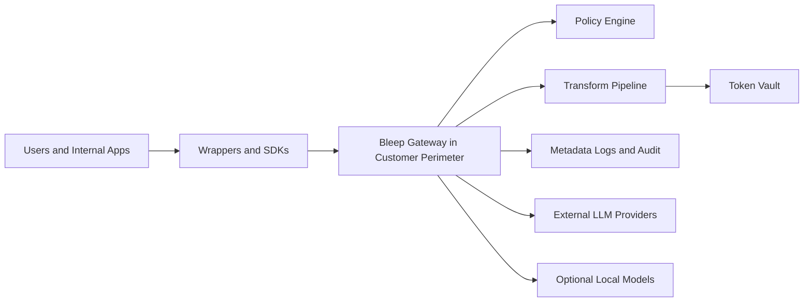
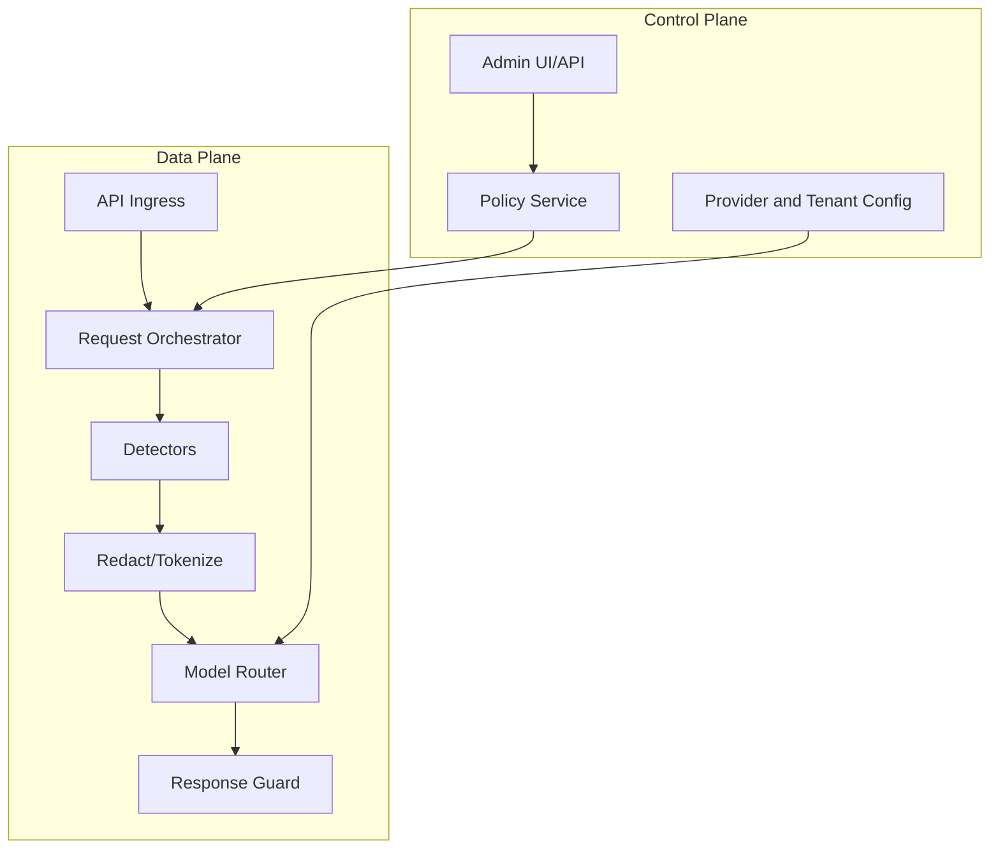
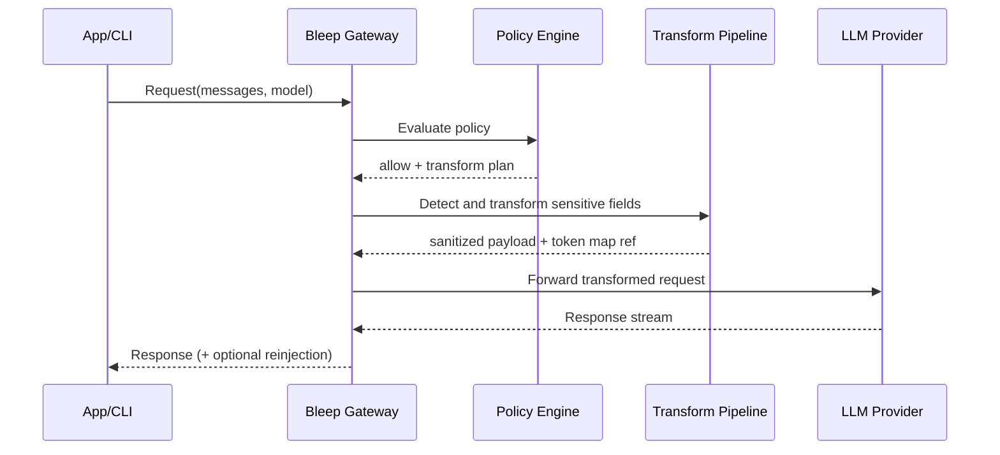
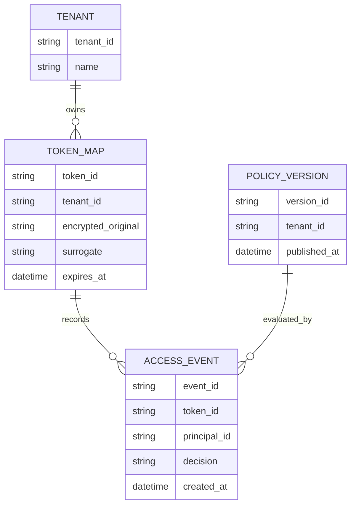
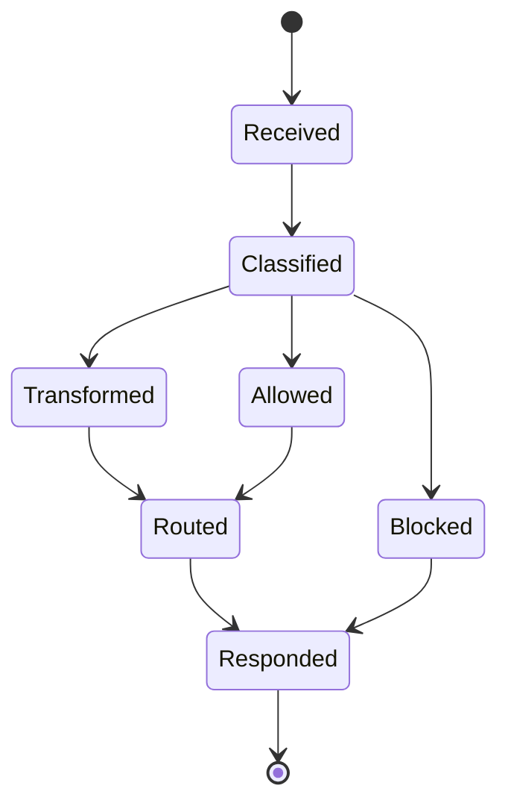
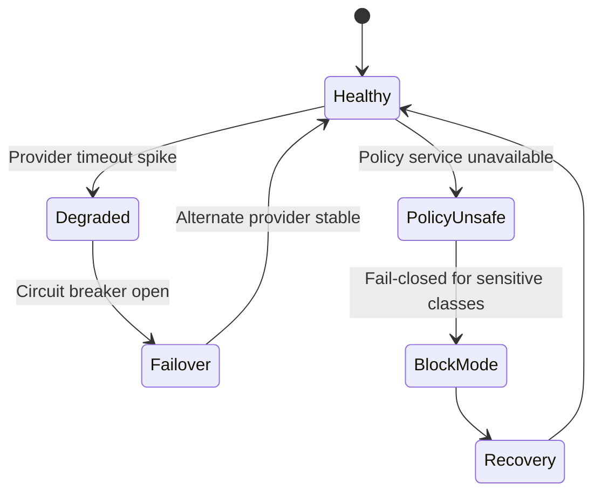
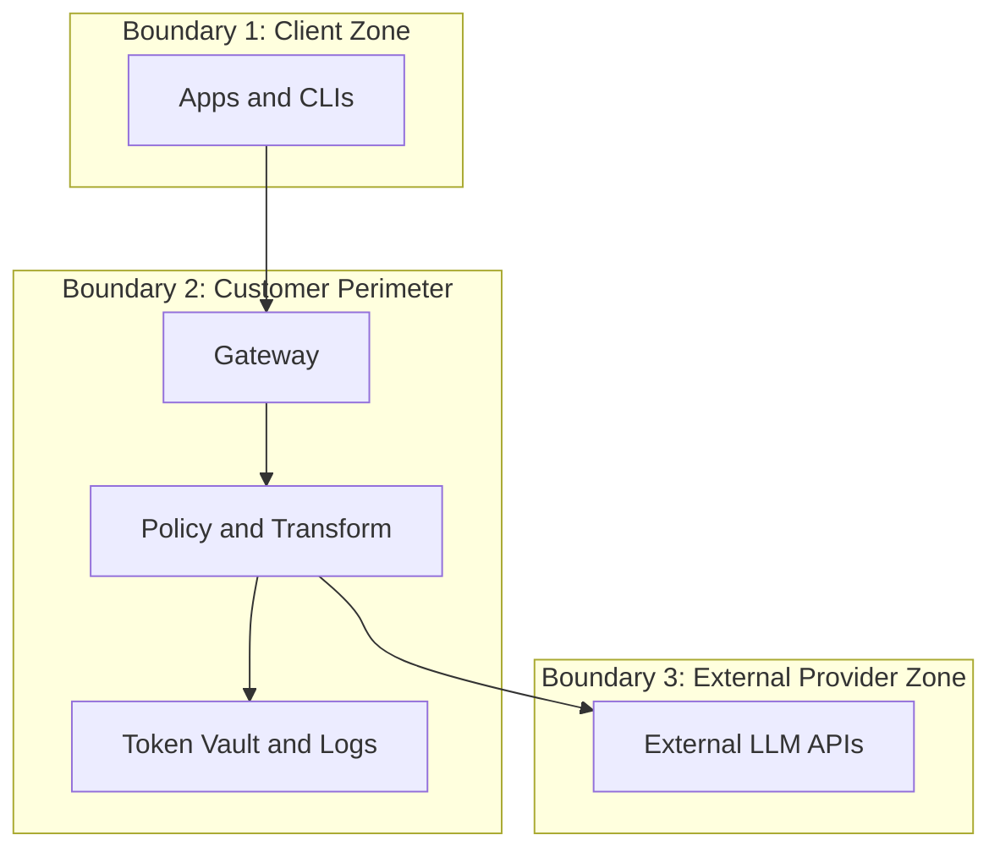
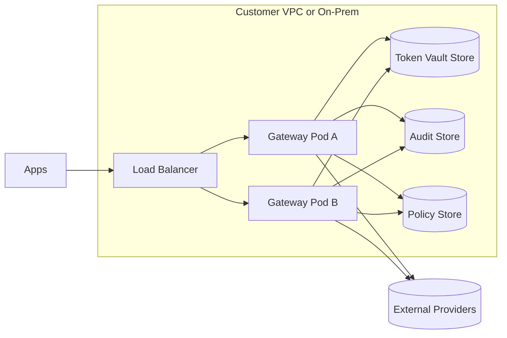
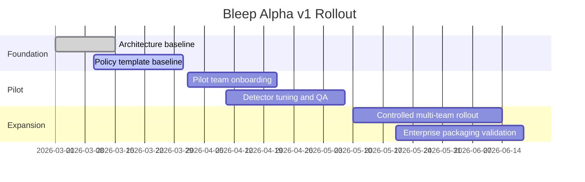
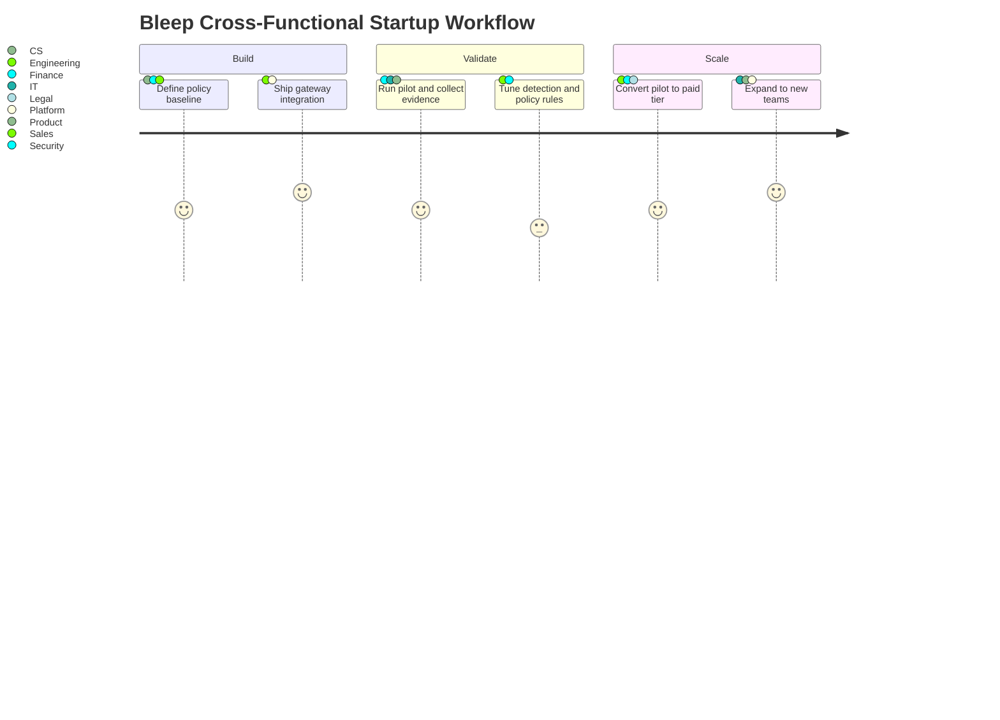

# Bleep Technical Mermaid Diagram Pack

This file provides architecture-level Mermaid diagrams across different diagram types for planning, design review, and slide reuse.

## 1) System Context (flowchart)

## 2) Component View (flowchart)

## 3) Request Sequence (sequenceDiagram)

## 4) Token Vault Data Model (erDiagram)

## 5) Policy Decision Lifecycle (stateDiagram-v2)

## 6) Failure and Recovery (stateDiagram-v2)

## 7) Trust Boundaries (flowchart)

## 8) Deployment Topology (flowchart)

## 9) Alpha Rollout Plan (gantt)

## 10) Team Interaction (journey)

